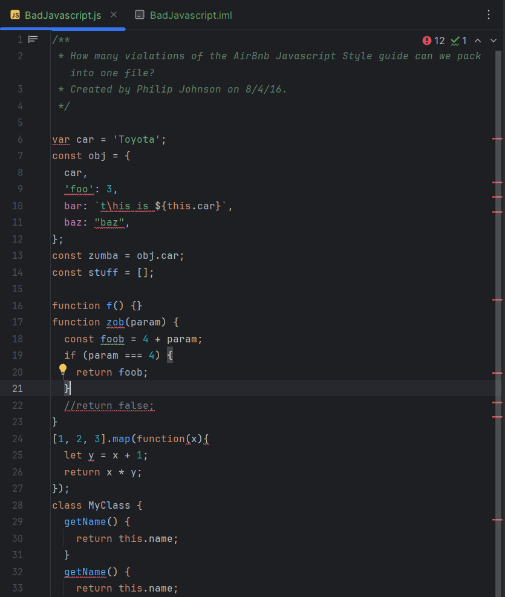

As you may already be familiar, feng shui is an ancient Chinese art of balancing the energies in one's surroundings. It's a methodical practice that is common to see applied modernly in home design and interior decoration, aiming to create a comfortable and conducive space to live in. Whether it's a space for home or for work, achieving features like having clear walkways in a room, being able to find things easily, or having clear, refreshing spaces for the mind to wander toward will faciliate comfort and efficiency in the environment, helping those living in them to live, work/study and focus better. Clarity, consistency, and self-maintainability all fall under the goal of feng shui.

Now, while I don't have six great tips on feng shui to share with you right now ([for those curious, this article does](https://www.sixides.com/articles/the-science-behind-feng-shui-beliefs-and-superstitions)), what I'd like to offer is even better: feng shui is a technique that can be applied to coding environments just as easily as it does to life. In programming, there too are many "Dos" and "Don'ts"!

## New software, new standards

How feng shui applies to code might best be explained through my experience with the new software tools I was introduced to recently: JetBrains' IntelliJ IDEA. While it's uncertain what the 'A' stands for, IntelliJ IDEA has so far proved to be a very robust IDE that has taken my current adventures in JavaScript to a new level. It works very well with GitHub Desktop, being fun to access and make changes to projects, then commit and push them all very quickly and seamlessly. There has even been a bit of introduction to HTML thrown in there as a teaser for what's to come, I'm sure...

But above all is a certain something that was also introduced through IntelliJ IDEA's vast collection of tools and programming aids - a code quality inspection tool called ESLint. Short for the titular ECMAScript standards that JavaScript is based on, I think ESLint is a very fitting tool for growing our skills in this language. Essentially, ESLint serves as a code 'spellchecker' that helps programmers conform their writing to ECMAScript conventions. It also comes with useful assistive features like suggested fixes to programming errors and feedback. Altogether, the support that ESLint and following its writing standards provides improves the ever-important legibility of one's code.

## The feng shui of code clarity

...

