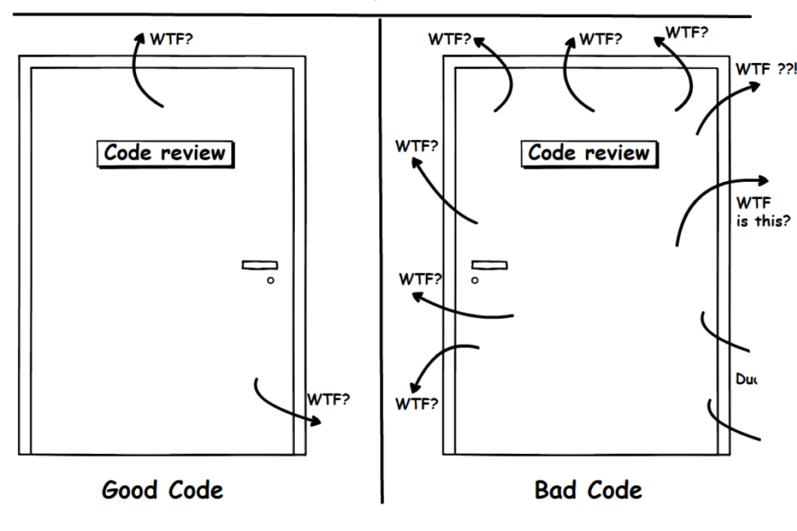

As you may already be familiar, feng shui is an ancient Chinese art of balancing the energies in one's surroundings. It's a methodical practice that is common to see applied modernly in home design and interior decoration, aiming to create a comfortable and conducive space to live in. Whether it's a space for home or for work, achieving features like having clear walkways in a room, being able to find things easily, removing clutter, or having clear, refreshing spaces for the mind to wander toward will faciliate comfort and efficiency in the environment.  It helps those living in them to live, work/study and focus better, improving their performance in mind and body in order to see improvements in life and career. Clarity, consistency, and self-maintainability all fall under the goal of feng shui.

Now, while I don't have six great tips on feng shui to share with you right now ([for those curious, this article does](https://www.sixides.com/articles/the-science-behind-feng-shui-beliefs-and-superstitions)), what I'd like to offer is even better: feng shui is a technique that can be applied to coding environments just as easily as it does to life. In programming, there too are many "Dos" and "Don'ts"!

## New software, new standards

How feng shui applies to code might best be explained through my experience with the new software tools I was introduced to recently: JetBrains' IntelliJ IDEA. While it's uncertain what the 'A' stands for, IntelliJ IDEA has so far proved to be a very robust IDE that has taken my current adventures in JavaScript to a new level. It works very well with GitHub Desktop, being fun to access and make changes to projects, then commit and push them all very quickly and seamlessly. There has even been a bit of introduction to HTML thrown in there as a teaser for what's to come, I'm sure...

But above all is a certain something that was also introduced through IntelliJ IDEA's vast collection of tools and programming aids - a code quality inspection tool called ESLint. Short for the titular ECMAScript standards that JavaScript is based on, I think ESLint is a very fitting tool for growing our skills in this language. Essentially, ESLint serves as a code 'spellchecker' that helps programmers conform their writing to ECMAScript conventions. It also comes with useful assistive features like suggested fixes to programming errors and feedback. Altogether, the support that ESLint and following its writing standards provides improves the ever-important legibility of one's code.

## The feng shui of code clarity

Where the feng shui pillars of clarity, consistency and self-maintainability intersects with code lies in how following coding standards leads to greater readability of the program.

For one, having clear, legible code is important for a variety of reasons. It's very often the case that someone else will be reading your code, whether it is a team of coworkers, a supervisor, or an educator grading it. Ensuring that your code is simple to understand for someone that doesn't share your mind leads to overall gains in efficiency and flow as part of a team, similarly to how feng shui optimizes the flow of energy in a given environment. The ease-of-readability aligns well with feng shui's focus on ease-of-access (clear pathways, easy to find things), and it's how the feng shui value of clarity connects to programming.

Likewise, following coding standards enhances one's code in terms of formatting and builds a habit out of it, leading to more code like it. This constructs a relationship of consistency between following a standards enforcer like ESLint and writing quality programs, which is a critically good trait to have showing across your work (while being equally advantageous on a personal level.) Keeping consistent with applying feng shui to all areas of your life, such as all rooms in your home, translates to programming things like conforming to naming conventions of variables and functions, code formatting and following style guides. These work conducively to make your code appear consistent across different programs, files, and projects as well, which can help to minimize design errors and keep the code overall familiar-looking and easy to parse for information (again aiding understanding of the code).

And lastly, applying feng shui to your programming will augment the self-maintainability of your code. Just like its importance in feng shui for interior design and living spaces, it improves the environment your code creates with future usage in mind, while reducing the amount of overhead that making changes to the established environment might create. For the home, this might manifest itself in ways such as selecting furniture and designing layouts that both age well, are easy to maintain, and are flexible to additions or changes. In the programming space, this would relate nicely with the infrastructure of one's program - how it's engineered by you - and how easy it is to maintain as the program expands in scope. Modular programming is a key concept that comes to mind here, as it encourages designing parts of a program so they work favorably with additional code, functions and classes that may not be designed by you. Promoting quality documentation of your code also impacts its future maintainability positively, since your code could very well be used for many years after the job was done.

## Coding standards = harmonic coding

Utimately, the concept of feng shui can be seen even in the realm of computer science and programming through things like code quality control and coding standards. Following conventions causes notable improvements in the legibility of code, improving its clarity for others to read and work on it, generating consistency that unifies one's work and increases its standard of quality, and keeps code maintainable beyond personal use, where good infrastructure and documentation enables code to be agile and adaptable for future use in any scope. Overall, coding standards invite harmony and balance into a program, which facilitates a productive coding environment for programmers much like feng shui can do for us in our day-to-day surroundings.