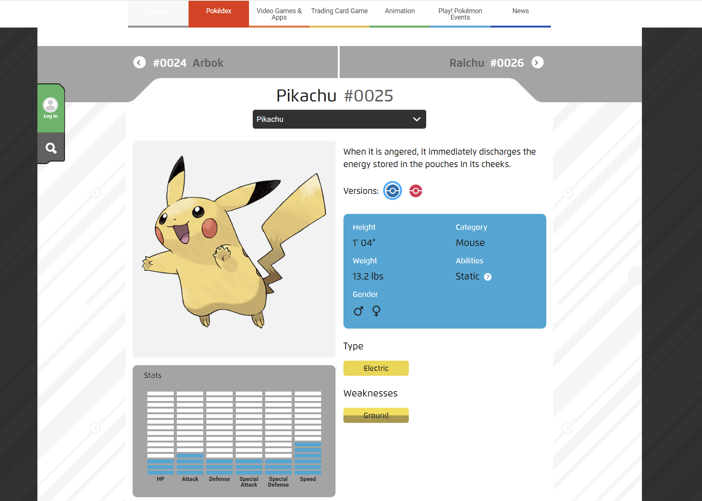
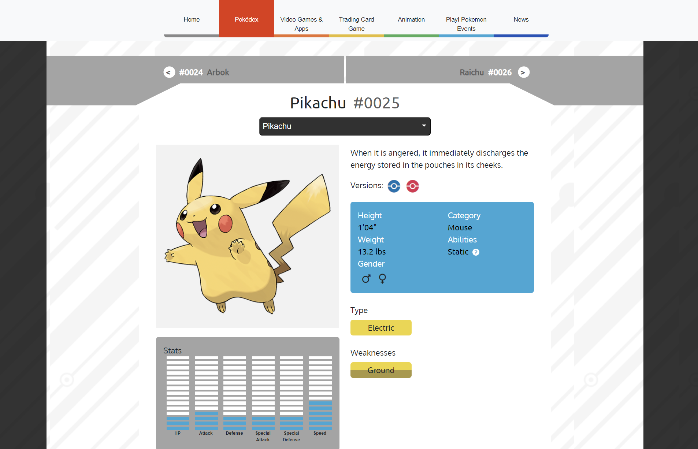
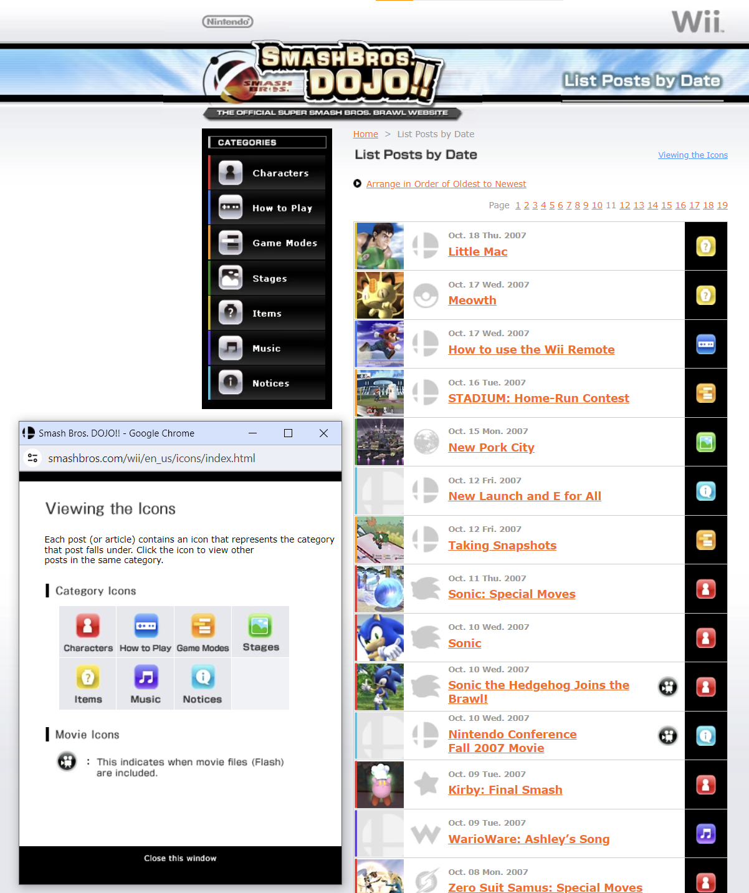
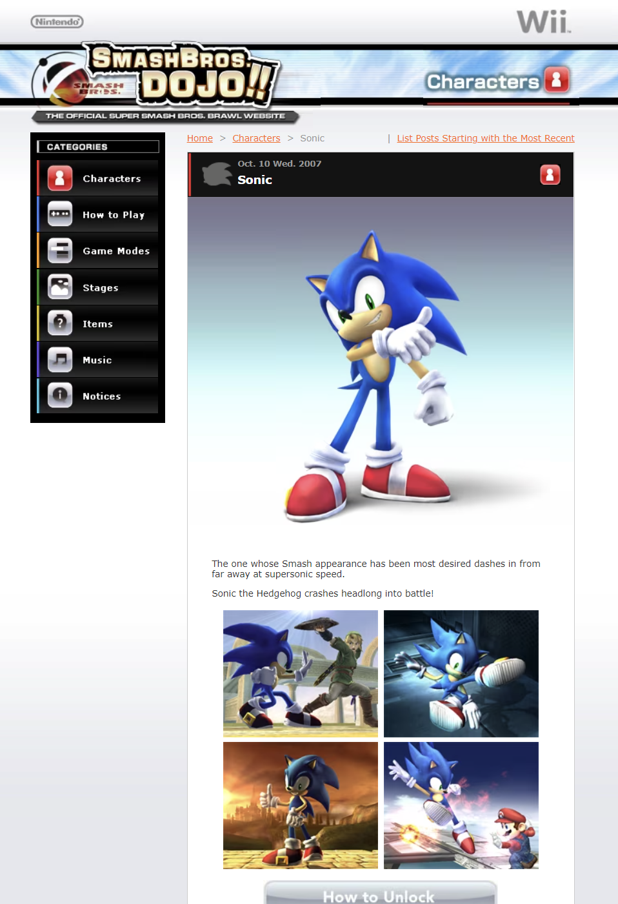

## Explorations In Web Development Thus Far

What I've been up to lately in the ICS world is learning some fundamental UI frameworks for web development. In my current Software Engineering course, we've spent a few weeks on learning HTML, CSS and Bootstrap, and the experiences in this unit 
have opened my eyes about the internet, really. When I'm looking at webpages, I'm examining the structure of its elements and content more than ever, with a better level of comprehension - enough to try to reconstruct it myself, as I'd find in a 
recent assignment provided by my class.

In this activity, we were tasked with taking a webpage of our choosing, and to recreate it to the best of our current abilities while primarily using Bootstrap (adding CSS styling when necessary). After checking out a few websites I thought might 
be fun to try (and their subsequent failing of some of the assignment requirements), I ended up at Pokemon.com's official page on pop-culture icon Pikachu. Not only did <i>The Pokémon Company</i>'s website layout match the criteria I needed, it 
was also fairly recognizable in its appealing HTML elements, and I could already feel that it would be an interesting and appropriate challenge for my level to try recreating it. And it would indeed prove to be a pretty good test: even just 
limiting the page to the section included in the screenshot below, there were a variety of highly styled elements to recreate.

  <figure style="display: inline-block;">
    
    <figcaption><em>The official Pokédex page for Pikachu on Pokemon.com</em></figcaption>
  </figure>
  <figure style="display: inline-block;">
    
    <figcaption><em>My slapdash re-creation of the Pikachu page using Bootstrap and CSS</em></figcaption>
  </figure>

Much of the styling was obscured in its CSS and un-viewable backend as well, so recreating the page's pieces was all up to 
the 
Bootstrap and CSS knowledge that I 
could apply. For some things, like Pikachu's stat chart, I was able to take inspiration from viewing the HTML for the page -in this case, each block of the chart was a small content block arranged as list elements in an unordered list- but like the 
rest, I 
still had to 
improvise 
the exact 
implementation 
I'd be using to get it to look similar. Overall, the assignment was great fun and proved to be an excellent way to apply myself with what I had learned thus far with our UI frameworks.

## Web Dev's Potential

What this assignment, as well as other previous ones in the unit, showed to me is the potential of web development. As mentioned earlier, I'm now looking at websites under the additional lens of how it's engineered. The more you work on HTML, 
elements like navigation bars, footers, and certain layouts or utilities can be recognized quickly and, with some modification, can even be transposed between web projects. Developing this kind of cross-comprehension of webpage design really 
expedites 
the process of developing them, and reinforces your knowledge and understanding of web development as a whole.

And, building webpages is really the heart of the internet itself when it comes down to it. Navigation and layout may differ in design, but they are always implemented in every website we visit, every interface we use as we peruse and explore the net, and how well or 
appealingly they are 
executed is what makes all the difference in how viewers will receive it.

## Reviving Old Memories
A short segway to end with that I'd like to divulge is how this recreate-a-website activity reminded me of what I loved about certain websites before, which is probably why I actually like this unit in web development a lot. Below is the old 
development log-developer blog hybrid website, <i>Smash Bros. Dojo!!</i>, for the 2008 game <i>Super Smash Bros. Brawl</i>.

  <figure style="display: inline-block;">
    
    <figcaption><em>The dev-log & blog website for Super Smash Bros. Brawl (2008)</em></figcaption>
  </figure>
  <figure style="display: inline-block;">
    
    <figcaption><em>Sonic the Hedgehog's posts on the website!</em></figcaption>
  </figure>

I think the website is a really good example of utilizing appealing content styling to organize tons of information in one
place, while keeping the website easy to parse and navigate. Again, it's all about navigation and presentation when it comes to positive reception of a website! The website was really inspiring for me as a kid; there is so much you can do visually 
with styled
content divisions, and creating your own webpages/websites is a good vehicle for getting pet projects going as well. All in all, these explorations in web dev and UI frameworks have been really encouraging and makes me hopeful for my own passions 
moving forward.

