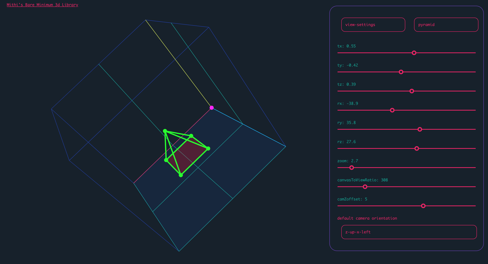

My life-long ambition has always been in the arts, with my passions stemming from my hobby in drawing and exposure to video games from an early age. Due to the latter, I have always been enamored with the concept of computer graphics, and it is the overlap between the realms of art and technology that fuels my interest in the realm of software development and engineering. The potential for software to serve as a canvas for artistic vision is what drives my current aspirations in the ICS field. To me, software, programming and video games are altogether another way in which humans are able to achieve creative expression - in other words, it's art just as well.

## 'Leveling Up' Creative Passions

In pursuing this endeavor, I have taken up learning software programming through university education. By doing so, I hope to cultivate the skills that would allow me to create robust projects of my own, like web, desktop or mobile applications that can take advantage of my artistic creativities. Goals like developing games and understanding graphics are what I look forward to as I proceed in learning programming. These do not need to be from scratch either; I will also be building the skills to take advantage of any toolkits available, aptly and professionally, with my energies free to be focused on what I would enjoy most from these projects - bringing my creative processes to life, in a visual and interactive medium.

      
      

### Where Purpose Lies

When it comes to an audience for these projects, I realize that it is, in large part, a pursuit in self-fulfillment. But it is also an interest in sharing enjoyment and fulfillment to the world. For me, art has always been an instrument of bringing happiness to others and bridging connections. And as a project of passion, it is enough for me to know that someone, anyone else enjoyed it as well. The interplay of art and programming also serves to preserve certain kinds of software experiences much like preserving art - 'classic' games and genres, for instance, can be kept alive by developing similar kinds of projects and iterating or modernizing them, the same way in which artists can restore interest in old series, characters and art-styles by illustrating them again for modern audiences.

## Exposing a career-focus

Of course, a key objective from going through an ICS program also lies in discovering the possibilities within the scope of software engineering, which will guide my trajectory in ICS as a career. Right now, although I know what I want to do with the knowledge and skills as a personal passion, its future as a career of mine still feels shrouded in mystery to me. Hopefully, the curriculum and its practical experiences will offer me an idea of the various specializations within the field, and it may help me narrow down how to balance programming as both a career and a personal interest. As of right now, though, honing in on the development and engineering aspects of it are what has me engaged the most, and they may be the areas that would work most conducively with the personal motives I have cooking on the backburner.

## Setting Expectations

In short, my journey in software engineering and development is not just a pursuit of technical mastery but an exploration of the intersection between art and technology. Through the ICS program, I am anticipating honing my skills in software development, gaining diverse experiences to help me decide on a career focus, and overall leveraging ICS as a career pursuit in tandem with my personal artistic passions.

