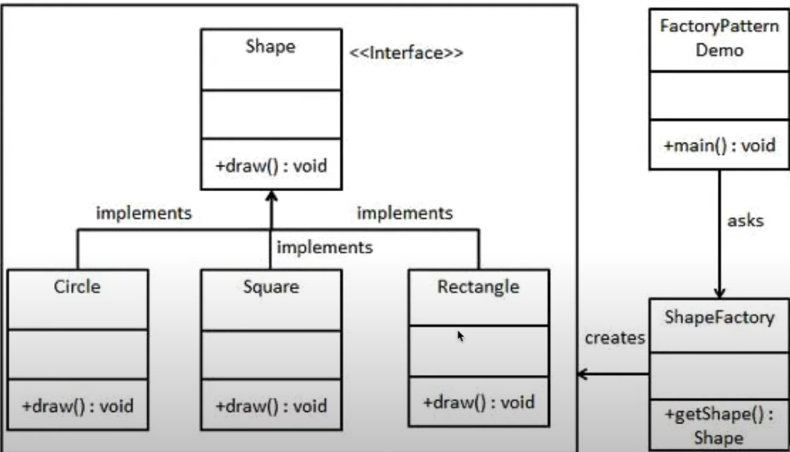

    

There are do'ers and creators, and all programs need its own grand architect to engineer the systemic designs and structures that will bring it to life. In the realm of software engineering, programmers can achieve this through the use of _design 
patterns_, which are the blueprints that guide the construction of software applications in ways that are efficient, repeatable, and "splashable" between almost any project you can conceive of.

## What are "Design Patterns"? Navigating Application Design
As high-level engineering principles, design patterns are critical for their use in standardizing and simplifying software development, building conventional approaches and systems to tackling common problems in software engineering. They are 
the 
blueprints that 
guide the 
construction of software applications, and they are the tools that help us to build robust, scalable, and maintainable software systems.

Design patterns offer different solutions for different problems (object-orient designs, class-based designs; language-specific designs, architectural designs, UI, databases, and more.) Infamously, the _Gang of Four_ (GoF) design patterns 
(numbering as many as 23 here) are 
displayed in the following chart.

    

### Back-pocket Patterns
Having at least a few design patterns that you can rehearse yourself with and whip out during interviews was something that was stressed to me 
during 
my time in my software engineering course. As encompassing as they are, design patterns can be an aspect of programming that is easily overlooked before they become a problem for you (i.e., when you suddenly need to know them!)

Thus, the 
following section will break into an informative and (ideally) referable segment that highlights some design patterns 
that 
are useful to be 
aware of and 
keep in 
your back-pocket. Let's 
remember 
them as BPPs.
#### Singleton
The Singleton design pattern is said to be the most prolific or basic of design patterns, so we'll tackle it first here. This pattern derives its namesake from its usage, where implementation of a Singleton design is meant to emulate _global 
variables_ in a language or environment that otherwise doesn't support them. This singularity is twofold, as you gain the benefits of a global-scope reference, while also mandating that there can only be one instance (one state) of the 
class/object/variable, 
so any changes done to it will be reflected globally.

    

Singleton design patterns are easy to implement, but aren't considered thread-safe, and come with the expected drawbacks of having global states - they can be difficult to debug and maintain, and can lead to unexpected behavior. As a result, 
Singleton design is sometimes referred to as an _anti-pattern_. 

#### Factory
A Factory design pattern captures the idea of having a "factory" method that can retrieve different kinds of classes or objects that might be dependent on another class/object. In this example diagram below, the ShapeFactory method returns some 
subclasses that 
represent different shapes, which all inherit/implement some dependency from the generic Shape class. 

    

The benefit of a Factory design is in how, for instance, our ShapeFactory method masks the underlying architecture of building shapes, offering security while compartmentalizing and simplifying instantiation of things like shapes in the program, 
which might require invoking many other classes to construct any single shape object. 
There is just one throughput to handle many different processes/classes/objects at once, just like a real factory! On the flipside, it's just a bit more complicated to set up compared to a typical object constructor.
#### Observer
Observer design patterns have everything to do with event handling tasks. To add an observer object is to have it monitor other objects (the observers' "subjects") for state changes. When triggered, the observer will then execute whatever 
functions it 
contains a la event handlers.

In the diagram, we can see how the subject actually holds a collection of its observers and notifies them of any respective events they are observing. In turn, the observers tell the "brain" about what events happened, which can then impart some 
change back onto the subject we started with.

    

Observer designs allow for more flexible structuring of event handling. Since the event triggers, or observers, are part of a collection, their relationships with the subject don't need to be hard-coded into the program (what's known as 
"tight-coupling"). This approach is known as a one-to-many dependency, and both allows any number of dependencies (observers) to run with the program, and allows these dependencies to change during run-time. For downsides, having a lot of 
observers can cause performance issues, and the design can be difficult to debug with race conditions in multi-threaded systems, or complicated trace routes due to the multitude of events occurring and possibly daisy-chaining along the way.

#### MVC
Lastly we have MVC, the ~~Marvel Vs. Capcom~~ _Model-View-Controller_ design pattern (I wish I had the former in my back-pocket!)

When it comes to web design, MVC is as go-to as the Singleton design pattern is common knowledge. The reason for this is MVC's connection to user interfaces (UI), where MVC dictates a separation between the internal mechanisms of handling data
(the Model) and the 
user-end 
representation (the View). The Controllers are the methods and processes that bridge the gap between the two, handling user input and updating the Model and View accordingly, and their relationships can be seen in the diagram below.

    

When it comes to analyzing MVC's scale of benefits vs. drawbacks, it's not as clear cut as the other design patterns discussed. The skills required to build a good user-end experience, the View component, can differ drastically from the skills 
needed to build a powerful or efficient Model component, so the difficulty of applying MVC largely lies in that relationship and how complex the application features are in a given project.

## "Pattern Recognition"
As I ran through these design pattern styles like those listed bove, I've come to recognize some application of design patterns in the projects I've already worked on through learning software engineering. Much of the course's content had us 
adhering to a certain process, and moving past fundamentals we spent a great deal learning how to navigate and work off of existing frameworks/app environments. Take the following web pages, for example, which are all things we learned how to 
reconstruct following certain, similar design principles between them:

  <figure style="display: inline-block;">
    
  </figure>
  <figure style="display: inline-block;">
    
  </figure>
<figure style="display: inline-block;">
    
  </figure>

Each of these webpages featured similar layouts and structures, and the process of building them was a great exercise in recognizing the patterns that were being used to construct them. The same can be said for the Meteor application I built 
(pictured below) as 
part of the Rainbow Cards team, [Manoa Rainbow Cards](https://manoa-rainbow-cards.xyz/), which was a project that had us working with a pre-existing framework and building off of it. We also implemented the same design pattern-like techniques 
from the prior web development projects, and the experience was a great way to see how design patterns can be applied in a real-world setting.

    

## Parting Thoughts
Overall, design patterns are an excellent way of standardizing and simplifying software development, and they are a great way to ensure that your code is both readable and maintainable. It puts the _engineering_ in software engineering, and 
truthfully, we can see the same principles of design patterns in other aspects of life, too. From the way we organize our daily routines to the way we structure our living spaces, design patterns are everywhere, and they are a great way to 
ensure that we are living our lives in a way that is both efficient and effective. In a sense, design patterns are another way of saying "good habits."

