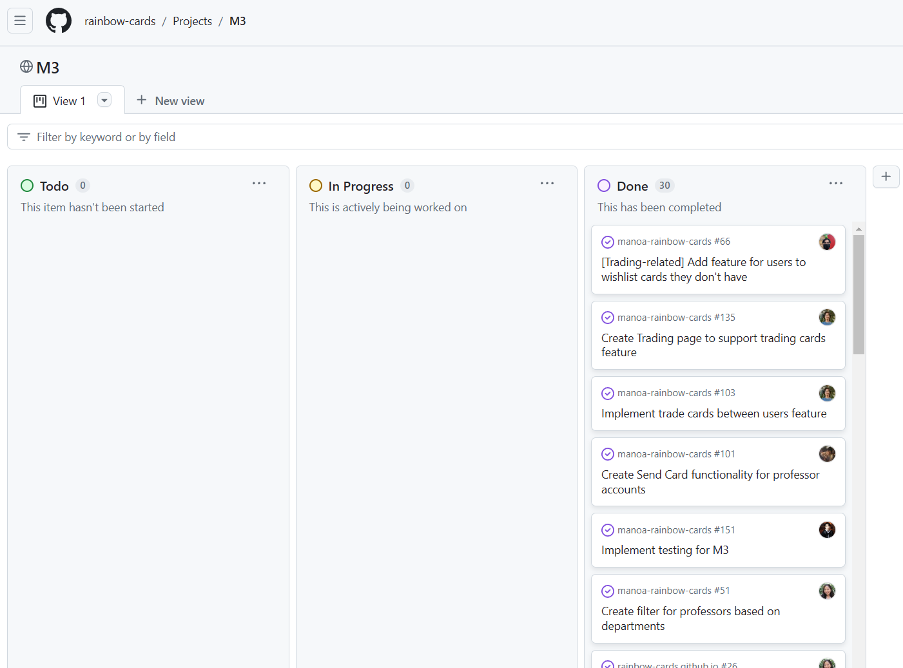

### So, you want to be a Software Engineer?

Welcome to the Software Engineering Club! Here, you'll learn some of the ropes of software development and the various techniques and practices that are essential to having a smooth and successful experience in the field. Below are the club's 10 tenets that all software engineers should inform themselves of and adhere to so they may best succeed in their personal and career endeavors.

### The Software Engineering Club's 10 Tenets
1) [_Agile project management_ is key!](#agile-project-management)
2) Take advantage of _functional programming_!
3) Know the ins-and-outs of your _development environment_!
4) Follow _coding standards_! (See also: ["_Feng Shui Programming_"](https://johnserraon.github.io/essays/feng-shui-programming.html))
5) Stick to following _design patterns_! (See also: [_Rules of Creation_](https://johnserraon.github.io/essays/rules-of-creation.html))
6) [Don't be afraid to use _open source software_!](#open-source-software)
7) Explore different kinds of _user interface frameworks_!
8) _Configuration management_ is important, too!
9) [_Quality assurance_ is a must!](#quality-assurance)
10) Always consider the _ethics_ of what you make!

Whether on your own or among a sea of team members, follow these tenets and you'll be sure to find your own success in the world of software development!

Some of the above tenets have been selected for further elaboration below (or already have a related write-up talking about them!) Click on the links to read more about them, or skip to the jump if it's there!

#### No. 1: "_Agile project management_ is key!"

Our number 1 is all about the importance of agile project management in software development. With a growing project scope or adding members to your team, there are so many moving parts to any project. Thus, it is critical that your project has a structure to it that allows yourself and others to keep track of what needs to be done, what is actively being worked on and where, and what has already been completed. This is where agile project management comes in - for example, in the Manoa Rainbow Cards project, the team employed the use of a GitHub project board to keep track of the various tasks that needed to be done for the application per milestone. This project board offered a high level of transparency on each task's status, allowed for communicating what each task or issue needed for implementation, and made it overall simple to create and design tasks for the team to work on, thereby making it easy to build the project in pieces.

    
    
Pictured: Milestone 3 project board for the Manoa Rainbow Cards project. By the milestone's completion, as many as 30 tasks were completed by the team!

When approached in this way, a project becomes much easier to iterate on and see an overview of it, which helps lead developers to what needs to be worked on next at any given point of the project's development. Perhaps a task requires more support to implement its features, or causes unintended behavior in other areas of the project - with a system like a project board in place, complete with details and comments on each issue to track their progress, it becomes much easier to target and resolve these issues as they arise, and it is just as easy to create new issue tickets about them for the team to see, simultaneously documenting the needed features, changes and/or fixes. This aspect of this style of workflow is what puts the "agile" in agile project management, and it is why it such a key concept to understand and employ on your journey in software.

#### No. 6: "Don't be afraid to use _open source software_!"

It is often said that the greatest challenge of software development is knowing where to start. 
