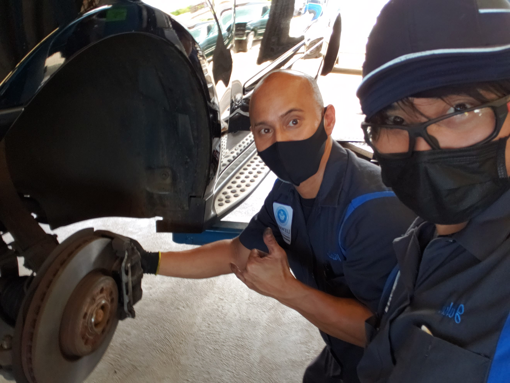
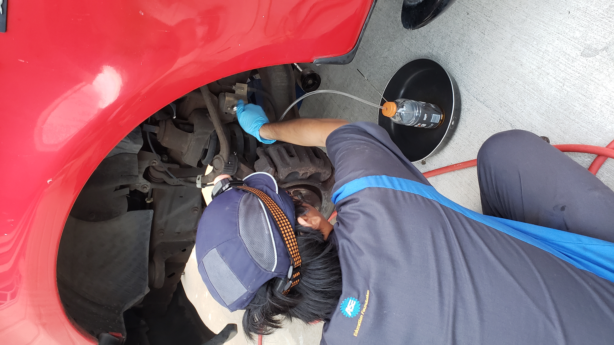
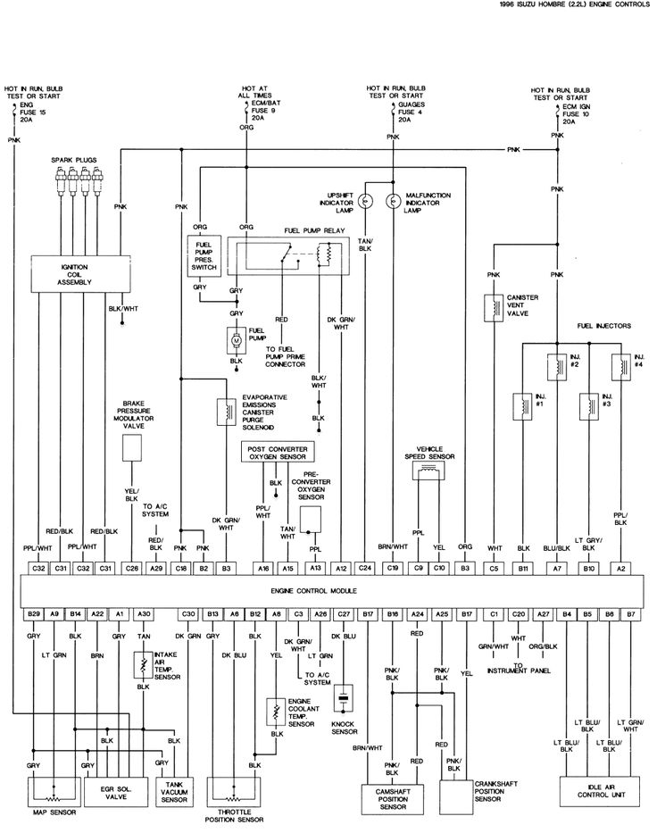
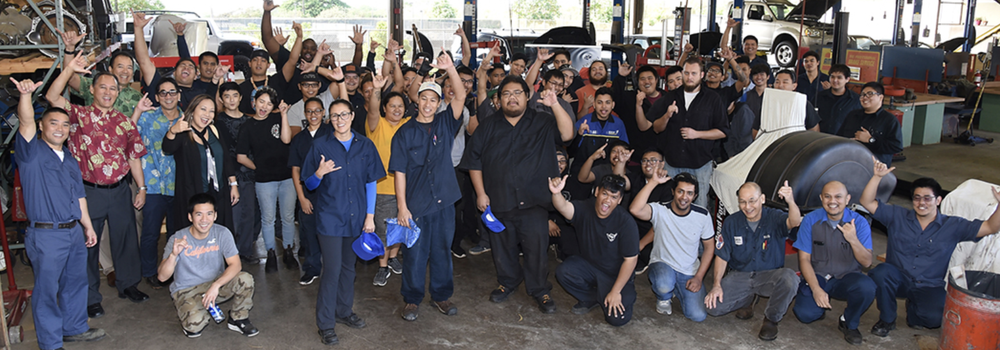

Leeward Community College is home to an Automotive Technology program, and with it a corresponding Associate in Applied Science degree for its successful completion. This program teaches students the necessary skillsets and techniques to perform as a trained professional in the wide range of automotive service and specialist careers that exist. Students are taught, instructed on, and expected to know how to diagnose vehicular problems from "front-to-back," being able to tackle any issue with a car and respond to any customer's problem description with certainty. A comprehensive arrangement of subjects are covered throughout the course, ranging from complete engine teardown to electrical diagnostics and engineering, understanding air conditioning systems and more.
From 2020 to 2022, during the novel COVID pandemic, I embarked on this alternative educatory pursuit to attain new skills and gain valuable experience. As a student in the Automotive Technology program, I was tasked with accruing a vast collection of tools and the knowledge of how to use and apply them to the various and often unpredictable scenarios that automotive service entails. I was thoroughly educated on the various mechanical, electrical and chemical systems that lie throughout modern vehicles, and I developed unique technical skills all throughout the program. 

  
  
  

Technical skills included the ability to read electrical wiring diagrams, being able to decipher and translate their layout to the vehicle, and trace electrical problems as I worked on the system to narrow down the cause of symptoms. Skills in quickly assessing and analyzing situations based on the symptoms and making logical judgements were critical, as well as being adaptable and cooperative in the automotive shop’s environment. Every vehicle, from the problem itself to the vehicle’s construction and even its documentation were unique, dynamic problems that needed to be dealt with skillfully, timely, and professionally.

Learning technical knowledge like various scientific principles and understanding of the engineering behind vehicular operations and features were necessary as well. Though it is not the job of automotive technicians to design and engineer vehicles, having similar comprehension and education as engineers was required to learn how to service, maintain and rebuild the machines and systems we worked on. And at times, automotive technicians are tasked or commissioned to design and manufacture solutions to problems and customer requests as well. For example, an instructor of mine in the program tasked another student and myself to design and construct a new wiring system for their personal vehicle, so that we could install and power a rail of auxiliary lamps. Accomplishing this task demonstrated our technical understanding of electricity and how it applied to electrical circuits, and we were also able to draft a new wiring diagram for the instructor's vehicle documentation.

The skills and experiences I learned from my time in the automotive program bolstered my capability to work with others in a professional environment, as I grew experienced in organizing people and distributing the workload among team members to get jobs done efficiently. I also developed prowess in handling high-stress and dynamic situations through the intensive work and fast pace required on tasks, and furthered leadership abilities when it came to strategizing how to tackle obstacles or overcome unforeseen issues and crises in the shop.

