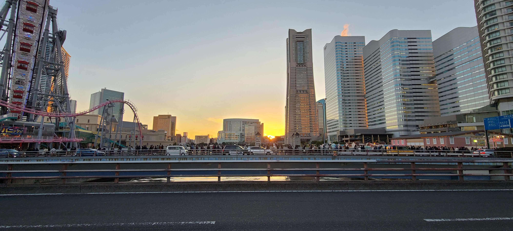
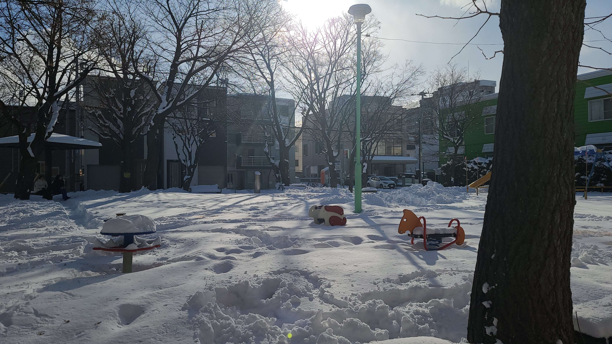
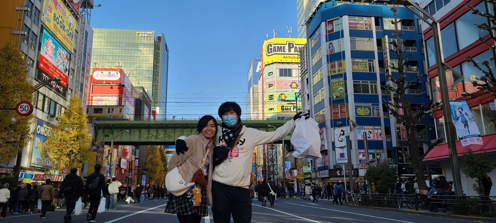

The 2023 japan trip was a long-awaited project for a group of my friends and acquaintances. Plans for it had initially started in 2019, but its fruition was delayed due to the COVID pandemic, where Japan would close its doors to tourism for several years, not re-opening fully until late 2023. As 2023 arrived, it would be decided that the trip would be scheduled to take place by December 2023, and Japan's tourism re-opening would lock in the dates for the trip - a 2 week-long stay from Dec. 20 to Jan. 03 of the following year.

It was in the early fall of 2023 that I had signed on to the travel project, just months before the target date for the trip, only to find out that there were virtually no travel plans yet in place beyond the flight information, some AirBnb reservations and a chaotic jumble of sightseeing ideas in a shared Google Docs document. With my joining the party bringing the total number of trip participants to 9, this was too large a group of people to not have a clear itinerary on what to do, especially for travel to a foreign country, and so there was work to be done.

With a full-time university semester already on my schedule, it was a crunch for time to construct an itinerary for the trip. To complete this successfully was a call to the resourcefulness, organization and time management skills that I had developed previously in other projects in life. I would carefully structure my workflow for the week to create windows where I could focus on travel research and meetings. Coordinating online meetings with the many trip participants was necessary when it came to deciding reservations, advance tickets and other time-sensitive aspects. Through these efforts and the application of learned skills, I was able to quickly construct a comprehensive travel itinerary from scratch. Overhauling the group's Google Docs page, I transformed it from a randomized mess of information into a formatted and easily parse-able document, complete with research information about each locale we were visiting, the major anchor events on certain dates like attraction reservations and restaurants, and charted routes for commuting to these destinations by train, tram or foot.

Another aspect to the trip was the matter of communication in a foreign country. Due to my recent experiences in learning the Japanese language, I was able to assume a leadership responsibly when it came to conversing with locals in Japanese, asking for help, directions and more when it was needed. Through this perspective, Japanese proved to be a powerful technical skill for facilitating the trip on a day-to-day basis.

All in all, the 2023 Japan trip was an unforgettable experience that allowed my skills to flourish and improve further in new ways, newly building extensive documentation and resource skills as well through arranging the itinerary, which all allowed the trip to play out enjoyably for everyone involved.

