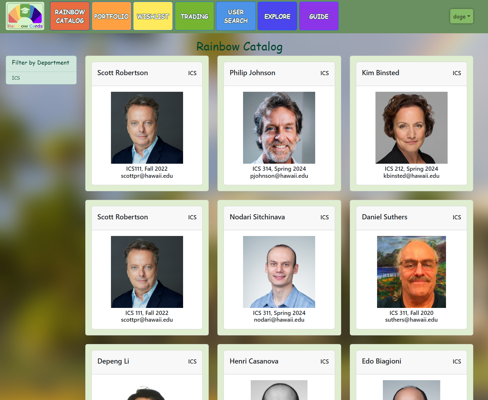

### Overview of Manoa Rainbow Cards

**Manoa Rainbow Cards** was a project I worked on as part of a 5-strong team in my 2024 ICS 314 class, for the course's final project. The project prompt we were provided was to create a Trading Card Game (TCG), where the UH Manoa professors are the cards, referred to as Rainbow Cards within the app. The goal of the project was to create an app that fostered increased familiarity and engagement between students and their mentors. Users could collect cards of professors which contained miscellaneous bits of information about that particular faculty member, and was designed to support long-term use with Rainbow Cards being serialized semesterly and unique to each course, featuring as many cards as there were professors to add or wished to participate. With the goal of collecting, users were intended to experience features such as trading cards, as well as potentially earn cards through repeated engagement with the website. The project was developed using the React user interface framework, as well as GitHub to facilitate agile project management and deployment of our app (_unfamiliar with these concepts?_ [_Read here to know more!_](https://johnserraon.github.io/essays/softeng-club-10-tenets.html))

If it is still up at the time of reading, you can view our project's live deployment here:

[manoa-rainbow-cards.xyz](https://manoa-rainbow-cards.xyz/)

### Personal Engagement with the Project
Throughout the 9-odd weeks of development, I learned a lot about what it takes to manage, organize, and develop on a team project. Up to this point in the course, we had been working on individual projects and assessments, so the transition to a team project was more of a surprise than I had imagined. Whatever thought processes you'd make on the fly internally now needed the care and tact to be communicated to 4 other people! With several different minds and as many pairs of hands, any kind of project can quickly become a wild western. However, our team was easily able establish a camaraderie with each other, and we each quickly fell into our own niche on the project.

Something I found myself glued to throughout the project's development was keeping our GitHub project boards up to date with the latest tasks and issues that needed to be worked on. The project boards were designed to meet each of our project's 3 milestones and more, and I found that it was a great way to keep track of the status of our project via the issue tickets. But while we practiced agile project management, a strategy that allowed all team members to progress the project dynamically and with modularity, I felt that there still needed to be some degree of big-picture project management to guide everyone and keep up the momentum of our project. While this came partially in the form of the project milestones, the steps along the way to meet those milestone requirements as well as our internal project goals weren't spelled out for us anywhere, and they needed to be planned out for the team to execute on.

To accomplish this, I made sure that the project board was always supplied with implementation tasks to tackle, using the various short-term and long-term project goals and features we would discuss as a group. I also made sure that each task was detailed with relevant information like documentation, implementation suggestions or related issue tickets, and also ensured that each issue had a corresponding branch associated with it - habits formed after an initial hiccup with the team's agile development process, that I was able to resolve for the team and continued supporting thereafter. In a similar vein, I also kept the project's GitHub documentation home page updated with the progress of our app and the required information it needed for our milestones so the team could focus on building our codebase early on, and additionally maintained a level of documentation in our team's Discord group so the project and its various instructions were easily accessible for the team throughout.

### Team Development Takeaways
Overall, I saw the importance in managing our project at a higher level, to enough of a degree that would keep things flowing while supporting the autonomy of the agile project management strategy we had going. I am often drawn to working in the background when it comes to any collaborative scenario (such as during events and parties), quietly taking care of the little things that need doing to keep things moving along and tidily so. In the context of a team software project, I believe that I was able to contribute similarly here. I feel that it served the team well in keeping the ball rolling on the project and allowing them to focus on the project, taking away certain overhead stresses that come with planning and the tedium of keeping things organized. As a result, we remained communicative and a conducive team until the end, working together to create a fun little project imprinted with our team's character.

#### About the Manoa Rainbow Cards Team

For more information on the **Manoa Rainbow Cards** and team's development process, check out the following links:

- [Rainbow Cards GitHub Org. & Repos](https://github.com/rainbow-cards)
- [Manoa Rainbow Cards Documentation](https://rainbow-cards.github.io/)